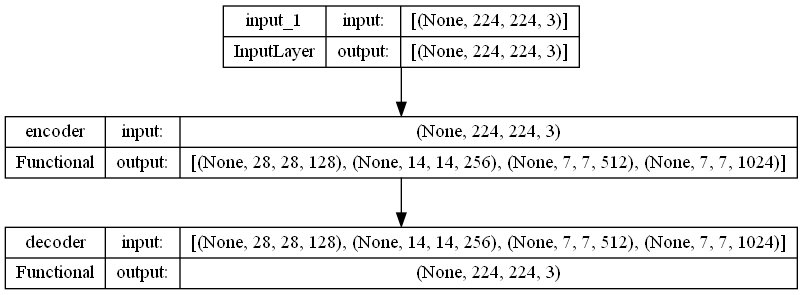

# Survival_Rate_Prediction_DLBCL

M1 project, which consists in the development of an AI model that predicts the survival rate of patients suffering from DLBCL on the basis of histopathological images.  

## Abstract 

The aim of this project was to predict the survival rate of patients with DLBCL by extracting relevant features from histopathological images using AI and, more specifically, CNNs. To build our dataset, we then combined these features with the patients' clinical data. We then used various methods such as PCA, UMAP or simply selecting the variables with the highest variances to try and reduce the number of features extracted. Once we had selected the features, we fitted a Cox proportional hazards model in order to demonstrate the usefulness of these extracted features in predicting the outcome of survival.

## Dataset 

DLBCL-Morph is publicly available at this link: 
https://stanfordmedicine.box.com/s/ub8e0wlhsdenyhdsuuzp6zhj0i82xrb1

This dataset has been made available thanks to : 
@misc{vrabac2020dlbclmorph,
    title={DLBCL-Morph: Morphological features computed using deep learning for an annotated digital DLBCL image set},
    author={Damir Vrabac and Akshay Smit and Rebecca Rojansky and Yasodha Natkunam and Ranjana H. Advani and Andrew Y. Ng and Sebastian Fernandez-Pol and Pranav Rajpurkar},
    year={2020},
    eprint={2009.08123},
    archivePrefix={arXiv},
    primaryClass={cs.CV}
}

## Model 

In order to build our model, we have fine-tuned another model called KimiaNet (https://arxiv.org/pdf/2101.07903v1.pdf). KimiaNet itself is a fine-tuned version of Densenet121 that has been trained on histopathological images of different types of cancer, but not on DLBCL. To fine-tune this model, we built an autoencoder that takes H&E stained patches as input. We used KimiaNet as the encoder part and built the decoder based on the Densenet121 architecture. The idea behind using an autoencoder is to perform unsupervised training of a model using the input as the output. Convolutional layers in the encoder reduce the dimensions of the input images and then the decoder tries to reconstruct the original images using a lower dimensional representation of the input images. In this way, we want to understand and represent only the deep correlations and relationships between data.

Here is the model architecture :

You can find the detailed architecture of the encoder and the decoder parts in the Figures directory.

## Code usage

### Building the model and training it
You can use [KimiaNet_AutoEncoder_3_blocks.py](./Scripts/KimiaNet_AutoEncoder_3_blocks.py) or [KimiaNet_AutoEncoder_4_blocks.py](./Scripts/KimiaNet_AutoEncoder_4_blocks.py) to build the autoencoder model and train it with train_autoencoder (the more blocks, the longer it takes to train).

### Extracting features from the trained model
Then use the trained model to extract features from your histopathology patch dataset using [KimiaNet_Keras_Feature_Extraction.py](./Scripts/KimiaNet_Keras_Feature_Extraction.py). 

### Filling the missing values of the clinical dataset
The clinical data given in the DLBCL-Morph dataset has missing values for some patients. Therefore, we filled in these missing values using a KNNImputer from the sickit-learn library. The code can be found in the [KNN_csv.py](./Scripts/KNN_csv.py) file. 

### Agregating the features per patient
Once we have the extracted features for each patch, we need to aggregate the feature vectors for each patient and add the clinical data to complete the patient data set. This can be done using either [features_processing_to_csv.py](./Scripts/features_processing_to_csv.py) or [GMM_Vectors_Agregation.ipynb](./Notebooks/GMM_Vectors_Agregation.ipynb). The first one will aggregate the vectors by selecting the median of each feature and the second one will use the Gaussian Mixture method.

### Survival rate prediction
Finally, the [survival_regression.ipynb](./Notebooks/survival_regression.ipynb) notebook allows you to fit a Cox proportional hazards model with the characteristics for each patient. Once the model has been fitted, you will be able to plot the survival curve for each patient. In this file you will also find the calculation of the C-index. The C-index is the metric that evaluates the accuracy of the ranking of predicted time. It is in fact a generalization of AUC, another common loss function, and is interpreted similarly. 

### Others
Some statistical information about the DLBCL-Morph dataset can be found in the notebook [Statistiques_patches.ipynb](./Notebooks/Statistiques_patches.ipynb). The [Models_comparison.ipynb](./Notebooks/Models_comparison.ipynb) notebook shows the training loss curves of the different models that we have trained in order to find the best hyperparameters for our model. Finally, the [Methods_comparison_sr.ipynb](./Notebooks/Methods_comparison_sr.ipynb) notebook was used to compare several parameters used to reduce the number of features or to fit the CoxPHFitter model.
